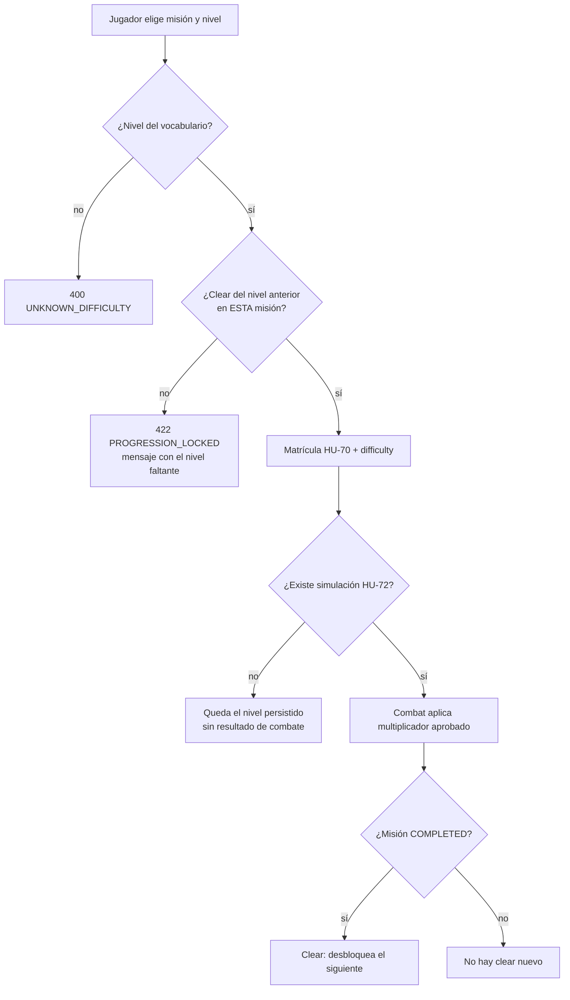

# HU-75 — Diseño de niveles de dificultad escalonada de misión

**Estado de este documento:** diseño de [TASK HU-75.1](https://github.com/Nexus-Battle-VI/Nexus-Battle-Management/issues/383), contrastado con el código. `GET .../difficulties` y su política están en `develop` de Missions ([#9](https://github.com/Nexus-Battle-VI/Nexus-Battle-Missions/pull/9)); la matrícula y el cierre que registra el progreso están en [Missions #15](https://github.com/Nexus-Battle-VI/Nexus-Battle-Missions/pull/15), todavía en borrador. Las partes de simulación y recompensa descritas abajo son diseño y no demuestran un flujo completo.

## Trazabilidad

- **Historia:** [HU-75 — Niveles de dificultad escalonada de misión](https://github.com/Nexus-Battle-VI/Nexus-Battle-Management/issues/60)
- **Diseño:** [TASK HU-75.1 #383](https://github.com/Nexus-Battle-VI/Nexus-Battle-Management/issues/383)
- **Implementación:** [TASK HU-75.2 #384](https://github.com/Nexus-Battle-VI/Nexus-Battle-Management/issues/384), parcialmente en `develop` de Missions; matrícula y ejecución en la PR #15.
- **Interfaz:** [TASK HU-75.3 #385](https://github.com/Nexus-Battle-VI/Nexus-Battle-Management/issues/385), preparada en [Web #122](https://github.com/Nexus-Battle-VI/Nexus-Battle-Web/pull/122) y montada en el detalle de [Web #140](https://github.com/Nexus-Battle-VI/Nexus-Battle-Web/pull/140), ambas en borrador.
- **Pruebas:** [TASK HU-75.4 #386](https://github.com/Nexus-Battle-VI/Nexus-Battle-Management/issues/386), con pruebas de política y HTTP en `develop` de Missions; la integración con ejecución sigue en la PR #15.
- **Requisito:** `RF-75`
- **Épica:** [EPIC-08 — Misiones](https://github.com/Nexus-Battle-VI/Nexus-Battle-Management/issues/8)
- **Colaboraciones:** HU-70 (matrícula), HU-72 (simulación), HU-74 (historial), HU-10 (recompensas)

Fuentes UML editables:

- [Caso de uso](../diagrams/hu-75-use-case.puml)
- [Actividad](../diagrams/hu-75-activity.puml)
- [Secuencia](../diagrams/hu-75-sequence.puml)
- [Dominio](../diagrams/hu-75-domain.puml)

Contrato HTTP y decisiones pendientes: [hu-75-mission-difficulty-v1.md](../contracts/hu-75-mission-difficulty-v1.md). El OpenAPI de las rutas integradas lo genera Missions.

## Vista rápida (para revisión)



Orden de desbloqueo: `NORMAL` → `HEROIC` → `LEGENDARY` → `MYTHIC`.

## Decisiones funcionales literales (HU publicada)

Estas reglas ya están en la historia. No se reinterpretan:

1. Los niveles son **Normal**, **Heroico**, **Legendario** y **Mítico**.
2. La dificultad se selecciona **al matricular** la misión (mismo acto que HU-70).
3. Heroico: enemigos con **50 % más** estadísticas.
4. Legendario: enemigos con **100 % más** estadísticas.
5. Mítico: dificultad máxima y recompensas **únicas y exclusivas**. La HU **no** publica un multiplicador numérico.
6. Las recompensas escalan: Heroico «mejores», Legendario «premium», Mítico «exclusivas».
7. Para desbloquear un nivel, el jugador debe haber **completado el nivel inmediatamente inferior al menos una vez**.
8. Si falta esa progresión, el sistema **bloquea** y muestra un **mensaje explicativo**.
9. Los ejemplos de la HU hablan de **la misma misión**, no de otra del tablón.

## Criterios técnicos propuestos (no aprobados por el PO)

Se usan para diseñar. No se presentan como CA de la HU:

| Id | Propuesta | Condición para volverla regla |
| --- | --- | --- |
| P-D1 | «Completar» = matrícula de **esa** misión en **ese** nivel cerrada como `COMPLETED`. Fallo o anulación no desbloquean. | Implementado en la rama de HU-72; confirmar con el PO |
| P-D2 | Normal está **siempre** desbloqueado. | Confirmación del PO |
| P-D3 | Se puede **repetir** un nivel ya completado. | Confirmación del PO |
| P-D4 | Vocabulario persistido: `NORMAL`, `HEROIC`, `LEGENDARY`, `MYTHIC`. No se usa Fácil/Difícil/Extremo. | Implementado; contrastar §7.8 del documento del curso |
| P-D5 | Heroico envía a Combat `enemyStatMultiplier = 1.5`. Legendario `2.0`. Mítico **sin número inventado**: se envía `MYTHIC` con multiplicador `null`. | Solicitud construida en la rama de HU-72; falta motor y decisión del PO para Mítico |
| P-D6 | El multiplicador aplica a estadísticas **enemigas** (propuesta: vida, ataque y defensa). No escala al héroe. Redondeo: pendiente. | PO |
| P-D7 | Missions publica un descriptor `rewardTier` (`STANDARD`, `IMPROVED`, `PREMIUM`, `EXCLUSIVE`) al consultar los niveles; la matrícula actual solo persiste `difficulty`. Montos, ítems y rareza los define [HU-10](https://github.com/Nexus-Battle-VI/Nexus-Battle-Management/issues/19). | Acordar liquidación con HU-10 |

## Caso de uso textual

### Seleccionar y aplicar dificultad de misión

**Actor principal:** jugador autenticado.

**Entradas conceptuales:** identidad del jugador, misión, héroe (HU-70) y nivel de dificultad.

**Precondiciones:**

- el testimonio es válido;
- la misión existe y, para HU-70, está disponible en el tablón;
- el héroe cumple las reglas de HU-70 (fuera de alcance de este diseño, se invocan);
- el nivel pedido pertenece a `{NORMAL, HEROIC, LEGENDARY, MYTHIC}`.

**Postcondiciones (camino feliz):**

- la matrícula queda registrada **con el nivel solicitado**;
- el progreso de dificultad no se altera todavía (el desbloqueo ocurre al **éxito**, no al matricular);
- la rama de HU-72 prepara para Combat el nivel y el multiplicador disponible; la aplicación real en Combat sigue pendiente;
- Missions **no** calcula daño ni genera aleatoriedad.

**Flujo principal (CA-01, CA-02, CA-04):**

1. El jugador abre el detalle de la misión y ve los cuatro niveles con su estado (libre o bloqueado) y el motivo.
2. Elige un nivel desbloqueado y confirma la matrícula (HU-70 + dificultad).
3. Missions consulta el historial de **esa misión** para **ese jugador**.
4. La política de progresión acepta el nivel.
5. Se persiste la matrícula con `difficulty`; `rewardTier` se informa en la consulta de niveles, pero no se persiste en la matrícula actual.
6. La rama de HU-72 pide a Combat la simulación con el código de dificultad y el multiplicador disponible (`null` en Mítico).
7. Al cerrar como `COMPLETED`, Missions registra `MissionDifficultyClear` y desbloquea el siguiente nivel.

**Alternativa — progresión insuficiente (CA-03):**

1. El jugador elige un nivel cuyo anterior no está completado.
2. Missions no escribe matrícula ni llama a Combat.
3. Responde rechazo de negocio con mensaje que nombra el nivel faltante y la misión.

**Excepciones de protocolo (propuestas):**

- sin testimonio: 401;
- dificultad desconocida: 400;
- progresión insuficiente: 422 `PROGRESSION_LOCKED`;
- héroe u ocupación: errores de HU-70, no se redefinen aquí.

## Fragmento de dominio

Missions es dueña de:

- `Mission` — definición del tablón (HU-70).
- `DifficultyLevel` — los cuatro valores ordenados.
- `DifficultyPolicy` — «el nivel N exige un clear de N-1 en la misma misión».
- `MissionDifficultyClear` — hecho: jugador + misión + nivel completado al menos una vez.
- `Enrollment` — lleva `difficulty`; el `rewardTier` es un descriptor de la consulta de niveles, pendiente de la liquidación de HU-10.

Combat es colaborador externo:

- recibe `difficulty` y `enemyStatMultiplier` (`null` en Mítico) desde la rama de HU-72;
- aplica estadísticas enemigas y bitácora;
- **no** decide si el jugador podía elegir ese nivel.

Web presenta el selector y el mensaje de bloqueo. No recalcula elegibilidad: consume la respuesta de Missions.

## Modelo conceptual de datos

Propietario: **Missions** (PostgreSQL, base lógica `missions`). Referencias a jugador y héroe son identificadores externos, no claves foráneas entre servicios.

| Hecho | Dueño | ¿Por qué se conserva? |
| --- | --- | --- |
| Nivel elegido en la matrícula | Missions | CA-01: la ejecución debe conservar el nivel pedido |
| Clear por jugador + misión + nivel | Missions | invariante de progresión (ADR-019) |
| Multiplicador publicado por nivel | Missions (política de dominio) | CA-02 / CA-04; Mítico queda `null` hasta el PO |
| `rewardTier` mostrado al consultar niveles | Missions | descriptor para la futura liquidación HU-10; no se guarda en la matrícula actual |
| Estadísticas efectivas del enemigo en combate | Combat | Missions no posee el agregado de batalla |
| Ítems y créditos entregados | Player/Inventory y Wallet | ADR-019; `operationId` |

Invariante de motor, no solo de código:

```text
UNIQUE (player_id, mission_id, difficulty)  -- sobre clears
CHECK (difficulty IN ('NORMAL','HEROIC','LEGENDARY','MYTHIC'))
-- la política «N exige N-1» se evalúa contra la tabla de clears
```

## Contrato conceptual

Capacidades de Missions, con estado por ruta en el [contrato](../contracts/hu-75-mission-difficulty-v1.md):

- listar, para una misión y un jugador, los cuatro niveles con `unlocked` y `lockReason`;
- matricular eligiendo `difficulty` (extiende el `POST` de matrícula de HU-70);
- rechazar con mensaje que cita el nivel faltante;
- registrar un clear al éxito de la simulación;
- entregar a Combat el código de dificultad y los parámetros **aprobados**.

Errores de negocio de esta HU:

| Código conceptual | Cuándo |
| --- | --- |
| `UNKNOWN_DIFFICULTY` | valor fuera del vocabulario |
| `PROGRESSION_LOCKED` | falta el clear del nivel inmediatamente inferior |

Firmas HTTP concretas: [hu-75-mission-difficulty-v1.md](../contracts/hu-75-mission-difficulty-v1.md). El [catálogo](../contracts/service-catalog.md) distingue la consulta integrada en `develop` de la matrícula aún en borrador.

## Separación con Jugar Online / Combat

```text
Missions decide: ¿puede este jugador correr ESTA misión en ESTE nivel?
Combat aplica:   enemigos según parámetros recibidos; bitácora y resultado.
```

HU-75 **no** reimplementa daño, turnos ni aleatoriedad. Esas dependencias (HU-17 a HU-20, HU-24, HU-72) condicionan la **demostración** del +50 % / +100 %, no la redacción de este diseño ni la validación de desbloqueo en HU-75.2.

## Matriz RF → CA → escenario

| RF | CA | Escenario | Entrada | Salida esperada | ¿Ejecutable hoy? |
| --- | --- | --- | --- | --- | --- |
| RF-75 | CA-01 | P-01 nivel disponible | Normal (o nivel ya desbloqueado) al matricular | Matrícula conserva ese nivel | En la PR de Missions #15; falta integración |
| RF-75 | CA-02 | P-02 Normal completada → Heroico | Clear `NORMAL` + selección `HEROIC` | Política permite Heroico; solicitud a Combat lleva `1.5` | Política en `develop`; falta simulación real |
| RF-75 | CA-03 | P-03 Heroico incompleto → Legendario | Sin clear `HEROIC` | Bloqueo + mensaje; sin matrícula | Consulta en `develop`; rechazo de matrícula en PR #15 |
| RF-75 | CA-04 | P-04 Legendario desbloqueado | Clear `HEROIC` + `LEGENDARY` | Descriptor `2.0` y `rewardTier=PREMIUM` | Descriptor en `develop`; faltan Combat y HU-10 |
| RF-75 | CA-04 | P-05 Mítico | Clear `LEGENDARY` + `MYTHIC` | Código `MYTHIC`, `EXCLUSIVE` y multiplicador `null` | Política en `develop`; escalado pendiente del PO |

Las fronteras que no son CA de la HU (Normal siempre libre, repetir un nivel ya completado, un fallo que no abre el siguiente, clears de otra misión o de otro jugador) están en la [matriz de transición y aislamiento](#matriz-de-transición-y-aislamiento); son la matriz de pruebas de HU-75.4 para la política pura de dominio.

## Matriz de transición y aislamiento

Tabla de decisión de `DifficultyPolicy` para **una misión** `M` y **un jugador** `P`. `clears(P, M)` es el conjunto de niveles con `MissionDifficultyClear` registrado para ese par.

| clears(P, M) | Solicita | Resultado | `required` en el 422 |
| --- | --- | --- | --- |
| ∅ | `NORMAL` | Acepta (P-D2) | — |
| ∅ | `HEROIC` | `PROGRESSION_LOCKED` | `NORMAL` |
| ∅ | `LEGENDARY` | `PROGRESSION_LOCKED` | `HEROIC` |
| {`NORMAL`} | `HEROIC` | Acepta | — |
| {`NORMAL`} | `LEGENDARY` | `PROGRESSION_LOCKED`: no se salta un nivel | `HEROIC` |
| {`NORMAL`, `HEROIC`} | `LEGENDARY` | Acepta | — |
| {`NORMAL`, `HEROIC`} | `MYTHIC` | `PROGRESSION_LOCKED` | `LEGENDARY` |
| {`NORMAL`, `HEROIC`, `LEGENDARY`} | `MYTHIC` | Acepta; `enemyStatMultiplier: null` hasta que el PO lo fije | — |
| {`NORMAL`} | `NORMAL` | Acepta: repetir un nivel completado está permitido (P-D3) | — |

`required` es siempre el nivel **inmediatamente inferior** al solicitado, aunque falten varios: el mensaje nombra el siguiente paso, no toda la escalera.

Casos de aislamiento que la política **rechaza** aunque se parezcan a progresión. Ninguno desbloquea:

| Caso | Hecho disponible | Solicita | Resultado |
| --- | --- | --- | --- |
| Otra misión | `clear(P, M2, NORMAL)` | `HEROIC` en `M` | `PROGRESSION_LOCKED`, `required = NORMAL` |
| Mismo nivel en otra misión | `clear(P, M2, HEROIC)` | `LEGENDARY` en `M` | `PROGRESSION_LOCKED`, `required = HEROIC` |
| Otro jugador | `clear(P2, M, NORMAL)` | `HEROIC` en `M` por `P` | `PROGRESSION_LOCKED`, `required = NORMAL` |
| Fallo o anulación | `Enrollment(P, M, NORMAL)` sin cierre `COMPLETED` | `HEROIC` en `M` | `PROGRESSION_LOCKED`: no existe clear (P-D1) |
| Matrícula sin terminar | `Enrollment(P, M, NORMAL)` activa | `HEROIC` en `M` | `PROGRESSION_LOCKED`: matricular no desbloquea |
| Salto de nivel | `clear(P, M, NORMAL)` | `LEGENDARY` en `M` | `PROGRESSION_LOCKED`, `required = HEROIC` |

Los fixtures de respuesta para cada estado están en el [contrato](../contracts/hu-75-mission-difficulty-v1.md#fixtures-por-estado-de-progresión).

## Impacto arquitectónico

| Contexto | Impacto | Estado |
| --- | --- | --- |
| Missions | Política y tabla de clears en `develop`; `difficulty` en matrícula y cierre con clear en PR #15 | Parcial |
| Web | Selector en PR #122 y montaje en matrícula en PR #140 | Borradores |
| Combat | Recibir la solicitud en PR #44; aplicar multiplicador / tabla Mítico sigue pendiente | Parcial |
| Player/Inventory y Wallet | Entrega según `rewardTier` | Pendiente HU-10 |
| Infrastructure | Este diseño y el contrato conceptual | **Este documento** |
| Account | Ninguno | — |

Ningún servicio lee la base de otro. El desbloqueo no se calcula en el frontend.

## Decisiones pendientes (visibles, no resueltas)

1. ¿Qué estadísticas enemigas escalan y cómo se redondean (enteros, dados, Poder)?
2. ¿Cuáles son los parámetros concretos de Mítico y sus tablas exclusivas?
3. ¿El documento del curso usa Fácil/Normal/Difícil/Extremo? Si sí, ¿cuál escala manda?
4. Confirmar con el PO la política implementada: solo `COMPLETED` de la misma misión crea un clear.

La extensión de `POST .../enrollments` con `difficulty` ya está implementada en la PR de Missions #15; queda pendiente su integración en `develop`.

El GET y la persistencia de clears están en `develop`. Hasta que el PO cierre las decisiones y Combat aplique el escalado real, **no** se pueden afirmar CA-02/CA-04 completos ni cerrar la HU padre.
